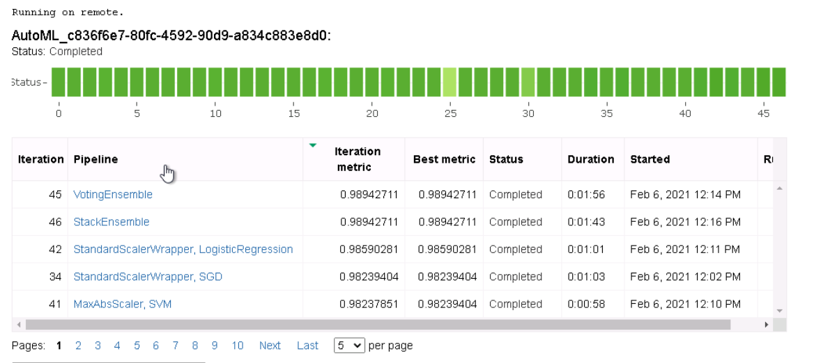
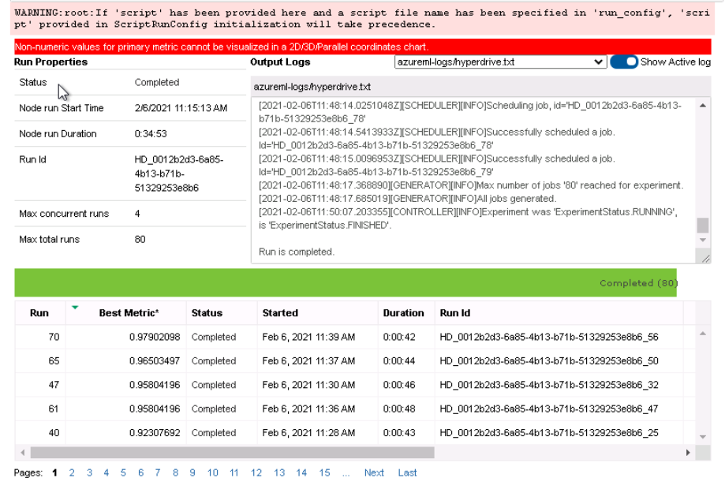
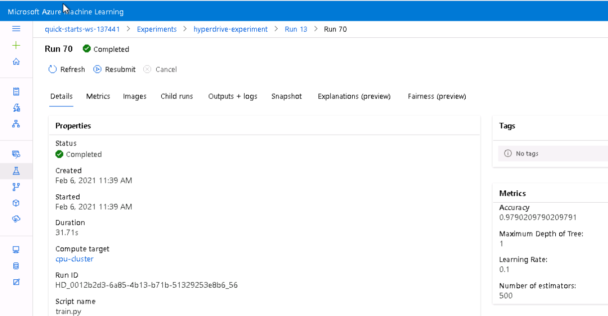
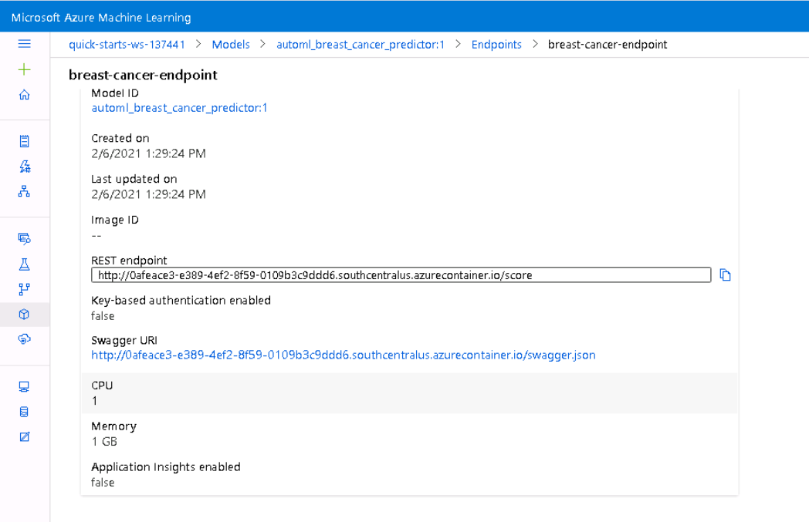
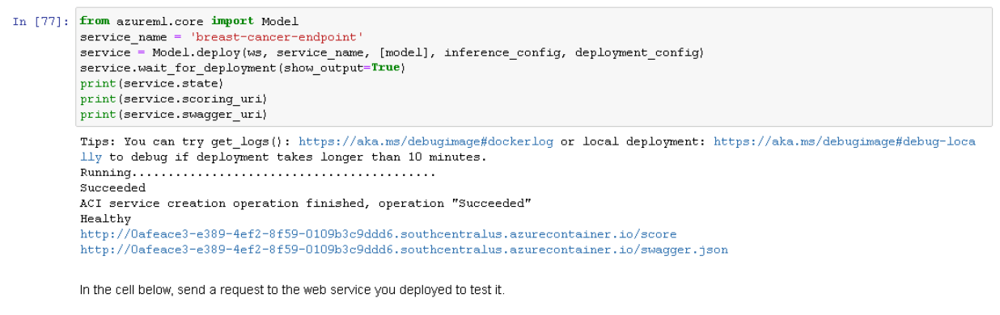
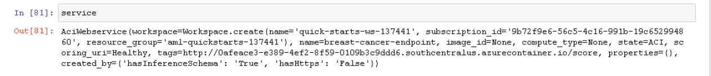

# Beast Cancer Prediction with Azure ML

We will do Binary Classification on breast cancer dataset. Our Goal is to compare Hyperdrive and AutoML trained model, deploy the best performing model and Use the End point for Inference.

## Project Step Overview:


First We selected breast cancer dataset for a Binary Classfication task. We wrote code in workspace notebook to access database. We did AutoML run and registered best model. We perform HyperDrive Run and Get Another Best Model. We compared the performance of both model and deployed the best one. Using Deployed Endpoint we made inference request.

## Project Set Up and Installation

Step1. Open Azure Machine Learning Studio By login into https://portal.azure.com/

Step2. Create a Cluster Instance with Default parameters. Detailed steps are provide in this [link](https://docs.microsoft.com/en-us/azure/machine-learning/concept-compute-instance)

Step3. Open Terminal from created Cluster Instance.

Step4. Clone this repository by using below command in terminal.
```
git clone https://github.com/bhadreshpsavani/Breast-Cancer-Prediction-AzureML.git
```

## Dataset

### Overview
The breast cancer dataset is a classic and very easy **binary classification** dataset.

| Attribute | Value |
| --- | --- |
| Classes | 2 |
| Samples per class | 212(M),357(B) |
| Samples total | 569 |
| Dimensionality | 30 |
| Features | real, positive |

We used sklearn version of dataset

The target is distributed like this,
| Target/Label | Percentage |
| --- | --- |
| 1 | 62.7417 |
| 0 | 37.2583|

### Task
Our task is to do Binary Classification on Breast Cancer Dataset, we will use all 30 features for training and testing.

### Access
Since we are using dataset from sklearn we can directly access dataset in Azure Notebook by importing sklearn datasets module,

We can do it like this, 
```python
from sklearn import datasets
data = datasets.load_breast_cancer(as_frame=True)

```
We should need to register dataset in Azure Studio while using it in AutoML we can do it like this,
```python
from azureml.data.dataset_factory import TabularDatasetFactory
from azureml.data.datapath import DataPath

# Create TabularDataset using TabularDatasetFactory
def_blob_store = ws.get_default_datastore()
print("Default datastore's name: {}".format(def_blob_store.name))
data_path = DataPath(datastore=def_blob_store, path_on_datastore='datapath')
ds = TabularDatasetFactory.register_pandas_dataframe(df, name='UCI_ML_Breast_Cancer', target=data_path)
```

## Automated ML:
AutoML does everything like model selection and Hyperparameter Tuning internally. We just need to provide details related to Task, Input and Compute. Here is the configuration for my automl experiment run.
```python
automl_settings = {
    "experiment_timeout_minutes": 50,
    "max_concurrent_iterations": 5,
    "primary_metric" : 'accuracy'}

automl_config = AutoMLConfig(
    task='classification',
    training_data = ds,
    label_column_name = "target",
    compute_target=compute_target,
    **automl_settings)
```
* `task`: we need to specify task type like `classification` / `regression` / `time-series`. Our's is classification,
* `training_data` : we need to provide entire data including labels/target. Note the dataset object should be `TabularDatasetFactory` type,
* `label_column_name` : The column name of Label Column / Target Column
* `compute_target` : is the object of training cluster on which automl job will be running
* `experiment_timeout_minutes`: We choose  `experiment_timeout_minutes=50mins` to give enough time to try all experiments,  
* `max_concurrent_iterations`: `5` according to max_nodes given while creating `training_instance`, 
* `primary_metric` : We choose Accuracy as Primary Metrics since data is not highly imbalanced it seems good fit for binary classification problem.

### Results
We got two models having highest same `98.94%` score:
1. Voting Ensemble
2. Stack Ensemble

It can be seen in below image



Both the best performing models are made up of multiple models i have shown models available in our best performing `stackensembleclassifier` in the [AutoML Notebook](automl.ipynb).

Stack Ensemble Model is made up of below parameters and Models,   
```
stackensembleclassifier
{'16': Pipeline(memory=None,
         steps=[('sparsenormalizer',
                 <azureml.automl.runtime.shared.model_wrappers.SparseNormalizer object at 0x7f554fe1bba8>),
                ('xgboostclassifier',
                 XGBoostClassifier(base_score=0.5, booster='gbtree',
                                   colsample_bylevel=1, colsample_bynode=1,
                                   colsample_bytree=0.7, eta=0.2, gamma=0,
                                   learning_rate=0.1, max_delta_step=0,
                                   max_depth=8, max_leaves=255,
                                   min_child_weight=1, missing=nan,
                                   n_estimators=100, n_jobs=1, nthread=None,
                                   objective='reg:logistic', random_state=0,
                                   reg_alpha=1.5625,
                                   reg_lambda=0.8333333333333334,
                                   scale_pos_weight=1, seed=None, silent=None,
                                   subsample=0.7, tree_method='auto',
                                   verbose=-10, verbosity=0))],
         verbose=False),
 '16__memory': None,
 '16__sparsenormalizer': <azureml.automl.runtime.shared.model_wrappers.SparseNormalizer object at 0x7f554fe1bba8>,
 '16__sparsenormalizer__copy': True,
 '16__sparsenormalizer__norm': 'max',
 '16__steps': [('sparsenormalizer',
                <azureml.automl.runtime.shared.model_wrappers.SparseNormalizer object at 0x7f554fe1bba8>),
               ('xgboostclassifier',
                XGBoostClassifier(base_score=0.5, booster='gbtree', colsample_bylevel=1,
                  colsample_bynode=1, colsample_bytree=0.7, eta=0.2, gamma=0,
                  learning_rate=0.1, max_delta_step=0, max_depth=8,
                  max_leaves=255, min_child_weight=1, missing=nan,
                  n_estimators=100, n_jobs=1, nthread=None,
                  objective='reg:logistic', random_state=0, reg_alpha=1.5625,
                  reg_lambda=0.8333333333333334, scale_pos_weight=1, seed=None,
                  silent=None, subsample=0.7, tree_method='auto', verbose=-10,
                  verbosity=0))],
 '16__verbose': False,
 '16__xgboostclassifier': XGBoostClassifier(base_score=0.5, booster='gbtree', colsample_bylevel=1,
                  colsample_bynode=1, colsample_bytree=0.7, eta=0.2, gamma=0,
                  learning_rate=0.1, max_delta_step=0, max_depth=8,
                  max_leaves=255, min_child_weight=1, missing=nan,
                  n_estimators=100, n_jobs=1, nthread=None,
                  objective='reg:logistic', random_state=0, reg_alpha=1.5625,
                  reg_lambda=0.8333333333333334, scale_pos_weight=1, seed=None,
                  silent=None, subsample=0.7, tree_method='auto', verbose=-10,
                  verbosity=0),
 '16__xgboostclassifier__base_score': 0.5,
 '16__xgboostclassifier__booster': 'gbtree',
 '16__xgboostclassifier__colsample_bylevel': 1,
 '16__xgboostclassifier__colsample_bynode': 1,
 '16__xgboostclassifier__colsample_bytree': 0.7,
 '16__xgboostclassifier__eta': 0.2,
 '16__xgboostclassifier__gamma': 0,
 '16__xgboostclassifier__learning_rate': 0.1,
 '16__xgboostclassifier__max_delta_step': 0,
 '16__xgboostclassifier__max_depth': 8,
 '16__xgboostclassifier__max_leaves': 255,
 '16__xgboostclassifier__min_child_weight': 1,
 '16__xgboostclassifier__missing': nan,
 '16__xgboostclassifier__n_estimators': 100,
 '16__xgboostclassifier__n_jobs': 1,
 '16__xgboostclassifier__nthread': None,
 '16__xgboostclassifier__objective': 'reg:logistic',
 '16__xgboostclassifier__random_state': 0,
 '16__xgboostclassifier__reg_alpha': 1.5625,
 '16__xgboostclassifier__reg_lambda': 0.8333333333333334,
 '16__xgboostclassifier__scale_pos_weight': 1,
 '16__xgboostclassifier__seed': None,
 '16__xgboostclassifier__silent': None,
 '16__xgboostclassifier__subsample': 0.7,
 '16__xgboostclassifier__tree_method': 'auto',
 '16__xgboostclassifier__verbose': -10,
 '16__xgboostclassifier__verbosity': 0,
 '34': Pipeline(memory=None,
         steps=[('standardscalerwrapper',
                 <azureml.automl.runtime.shared.model_wrappers.StandardScalerWrapper object at 0x7f554fe06898>),
                ('sgdclassifierwrapper',
                 SGDClassifierWrapper(alpha=1.4286571428571428,
                                      class_weight=None, eta0=0.01,
                                      fit_intercept=True,
                                      l1_ratio=0.7551020408163265,
                                      learning_rate='constant', loss='log',
                                      max_iter=1000, n_jobs=1, penalty='none',
                                      power_t=0.4444444444444444,
                                      random_state=None, tol=0.001))],
         verbose=False),
 '34__memory': None,
 '34__sgdclassifierwrapper': SGDClassifierWrapper(alpha=1.4286571428571428, class_weight=None, eta0=0.01,
                     fit_intercept=True, l1_ratio=0.7551020408163265,
                     learning_rate='constant', loss='log', max_iter=1000,
                     n_jobs=1, penalty='none', power_t=0.4444444444444444,
                     random_state=None, tol=0.001),
 '34__sgdclassifierwrapper__alpha': 1.4286571428571428,
 '34__sgdclassifierwrapper__class_weight': None,
 '34__sgdclassifierwrapper__eta0': 0.01,
 '34__sgdclassifierwrapper__fit_intercept': True,
 '34__sgdclassifierwrapper__l1_ratio': 0.7551020408163265,
 '34__sgdclassifierwrapper__learning_rate': 'constant',
 '34__sgdclassifierwrapper__loss': 'log',
 '34__sgdclassifierwrapper__max_iter': 1000,
 '34__sgdclassifierwrapper__n_jobs': 1,
 '34__sgdclassifierwrapper__penalty': 'none',
 '34__sgdclassifierwrapper__power_t': 0.4444444444444444,
 '34__sgdclassifierwrapper__random_state': None,
 '34__sgdclassifierwrapper__tol': 0.001,
 '34__standardscalerwrapper': <azureml.automl.runtime.shared.model_wrappers.StandardScalerWrapper object at 0x7f554fe06898>,
 '34__standardscalerwrapper__class_name': 'StandardScaler',
 '34__standardscalerwrapper__copy': True,
 '34__standardscalerwrapper__module_name': 'sklearn.preprocessing._data',
 '34__standardscalerwrapper__with_mean': True,
 '34__standardscalerwrapper__with_std': True,
 '34__steps': [('standardscalerwrapper',
                <azureml.automl.runtime.shared.model_wrappers.StandardScalerWrapper object at 0x7f554fe06898>),
               ('sgdclassifierwrapper',
                SGDClassifierWrapper(alpha=1.4286571428571428, class_weight=None, eta0=0.01,
                     fit_intercept=True, l1_ratio=0.7551020408163265,
                     learning_rate='constant', loss='log', max_iter=1000,
                     n_jobs=1, penalty='none', power_t=0.4444444444444444,
                     random_state=None, tol=0.001))],
 '34__verbose': False,
 '36': Pipeline(memory=None,
         steps=[('minmaxscaler', MinMaxScaler(copy=True, feature_range=(0, 1))),
                ('logisticregression',
                 LogisticRegression(C=4714.8663634573895, class_weight=None,
                                    dual=False, fit_intercept=True,
                                    intercept_scaling=1, l1_ratio=None,
                                    max_iter=100, multi_class='ovr', n_jobs=1,
                                    penalty='l1', random_state=None,
                                    solver='saga', tol=0.0001, verbose=0,
                                    warm_start=False))],
         verbose=False),
 '36__logisticregression': LogisticRegression(C=4714.8663634573895, class_weight=None, dual=False,
                   fit_intercept=True, intercept_scaling=1, l1_ratio=None,
                   max_iter=100, multi_class='ovr', n_jobs=1, penalty='l1',
                   random_state=None, solver='saga', tol=0.0001, verbose=0,
                   warm_start=False),
 '36__logisticregression__C': 4714.8663634573895,
 '36__logisticregression__class_weight': None,
 '36__logisticregression__dual': False,
 '36__logisticregression__fit_intercept': True,
 '36__logisticregression__intercept_scaling': 1,
 '36__logisticregression__l1_ratio': None,
 '36__logisticregression__max_iter': 100,
 '36__logisticregression__multi_class': 'ovr',
 '36__logisticregression__n_jobs': 1,
 '36__logisticregression__penalty': 'l1',
 '36__logisticregression__random_state': None,
 '36__logisticregression__solver': 'saga',
 '36__logisticregression__tol': 0.0001,
 '36__logisticregression__verbose': 0,
 '36__logisticregression__warm_start': False,
 '36__memory': None,
 '36__minmaxscaler': MinMaxScaler(copy=True, feature_range=(0, 1)),
 '36__minmaxscaler__copy': True,
 '36__minmaxscaler__feature_range': (0, 1),
 '36__steps': [('minmaxscaler', MinMaxScaler(copy=True, feature_range=(0, 1))),
               ('logisticregression',
                LogisticRegression(C=4714.8663634573895, class_weight=None, dual=False,
                   fit_intercept=True, intercept_scaling=1, l1_ratio=None,
                   max_iter=100, multi_class='ovr', n_jobs=1, penalty='l1',
                   random_state=None, solver='saga', tol=0.0001, verbose=0,
                   warm_start=False))],
 '36__verbose': False,
 '41': Pipeline(memory=None,
         steps=[('maxabsscaler', MaxAbsScaler(copy=True)),
                ('svcwrapper',
                 SVCWrapper(C=35.564803062231285, break_ties=False,
                            cache_size=200, class_weight='balanced', coef0=0.0,
                            decision_function_shape='ovr', degree=3,
                            gamma='scale', kernel='rbf', max_iter=-1,
                            probability=True, random_state=None, shrinking=True,
                            tol=0.001, verbose=False))],
         verbose=False),
 '41__maxabsscaler': MaxAbsScaler(copy=True),
 '41__maxabsscaler__copy': True,
 '41__memory': None,
 '41__steps': [('maxabsscaler', MaxAbsScaler(copy=True)),
               ('svcwrapper',
                SVCWrapper(C=35.564803062231285, break_ties=False, cache_size=200,
           class_weight='balanced', coef0=0.0, decision_function_shape='ovr',
           degree=3, gamma='scale', kernel='rbf', max_iter=-1, probability=True,
           random_state=None, shrinking=True, tol=0.001, verbose=False))],
 '41__svcwrapper': SVCWrapper(C=35.564803062231285, break_ties=False, cache_size=200,
           class_weight='balanced', coef0=0.0, decision_function_shape='ovr',
           degree=3, gamma='scale', kernel='rbf', max_iter=-1, probability=True,
           random_state=None, shrinking=True, tol=0.001, verbose=False),
 '41__svcwrapper__C': 35.564803062231285,
 '41__svcwrapper__break_ties': False,
 '41__svcwrapper__cache_size': 200,
 '41__svcwrapper__class_weight': 'balanced',
 '41__svcwrapper__coef0': 0.0,
 '41__svcwrapper__decision_function_shape': 'ovr',
 '41__svcwrapper__degree': 3,
 '41__svcwrapper__gamma': 'scale',
 '41__svcwrapper__kernel': 'rbf',
 '41__svcwrapper__max_iter': -1,
 '41__svcwrapper__probability': True,
 '41__svcwrapper__random_state': None,
 '41__svcwrapper__shrinking': True,
 '41__svcwrapper__tol': 0.001,
 '41__svcwrapper__verbose': False,
 '41__verbose': False,
 '42': Pipeline(memory=None,
         steps=[('standardscalerwrapper',
                 <azureml.automl.runtime.shared.model_wrappers.StandardScalerWrapper object at 0x7f55596b7c88>),
                ('logisticregression',
                 LogisticRegression(C=2222.996482526191, class_weight=None,
                                    dual=False, fit_intercept=True,
                                    intercept_scaling=1, l1_ratio=None,
                                    max_iter=100, multi_class='ovr', n_jobs=1,
                                    penalty='l2', random_state=None,
                                    solver='saga', tol=0.0001, verbose=0,
                                    warm_start=False))],
         verbose=False),
 '42__logisticregression': LogisticRegression(C=2222.996482526191, class_weight=None, dual=False,
                   fit_intercept=True, intercept_scaling=1, l1_ratio=None,
                   max_iter=100, multi_class='ovr', n_jobs=1, penalty='l2',
                   random_state=None, solver='saga', tol=0.0001, verbose=0,
                   warm_start=False),
 '42__logisticregression__C': 2222.996482526191,
 '42__logisticregression__class_weight': None,
 '42__logisticregression__dual': False,
 '42__logisticregression__fit_intercept': True,
 '42__logisticregression__intercept_scaling': 1,
 '42__logisticregression__l1_ratio': None,
 '42__logisticregression__max_iter': 100,
 '42__logisticregression__multi_class': 'ovr',
 '42__logisticregression__n_jobs': 1,
 '42__logisticregression__penalty': 'l2',
 '42__logisticregression__random_state': None,
 '42__logisticregression__solver': 'saga',
 '42__logisticregression__tol': 0.0001,
 '42__logisticregression__verbose': 0,
 '42__logisticregression__warm_start': False,
 '42__memory': None,
 '42__standardscalerwrapper': <azureml.automl.runtime.shared.model_wrappers.StandardScalerWrapper object at 0x7f55596b7c88>,
 '42__standardscalerwrapper__class_name': 'StandardScaler',
 '42__standardscalerwrapper__copy': True,
 '42__standardscalerwrapper__module_name': 'sklearn.preprocessing._data',
 '42__standardscalerwrapper__with_mean': True,
 '42__standardscalerwrapper__with_std': True,
 '42__steps': [('standardscalerwrapper',
                <azureml.automl.runtime.shared.model_wrappers.StandardScalerWrapper object at 0x7f55596b7c88>),
               ('logisticregression',
                LogisticRegression(C=2222.996482526191, class_weight=None, dual=False,
                   fit_intercept=True, intercept_scaling=1, l1_ratio=None,
                   max_iter=100, multi_class='ovr', n_jobs=1, penalty='l2',
                   random_state=None, solver='saga', tol=0.0001, verbose=0,
                   warm_start=False))],
 '42__verbose': False,
 '43': Pipeline(memory=None,
         steps=[('standardscalerwrapper',
                 <azureml.automl.runtime.shared.model_wrappers.StandardScalerWrapper object at 0x7f554fe15898>),
                ('sgdclassifierwrapper',
                 SGDClassifierWrapper(alpha=2.040895918367347,
                                      class_weight='balanced', eta0=0.0001,
                                      fit_intercept=True,
                                      l1_ratio=0.6938775510204082,
                                      learning_rate='constant',
                                      loss='modified_huber', max_iter=1000,
                                      n_jobs=1, penalty='none',
                                      power_t=0.8888888888888888,
                                      random_state=None, tol=0.0001))],
         verbose=False),
 '43__memory': None,
 '43__sgdclassifierwrapper': SGDClassifierWrapper(alpha=2.040895918367347, class_weight='balanced',
                     eta0=0.0001, fit_intercept=True,
                     l1_ratio=0.6938775510204082, learning_rate='constant',
                     loss='modified_huber', max_iter=1000, n_jobs=1,
                     penalty='none', power_t=0.8888888888888888,
                     random_state=None, tol=0.0001),
 '43__sgdclassifierwrapper__alpha': 2.040895918367347,
 '43__sgdclassifierwrapper__class_weight': 'balanced',
 '43__sgdclassifierwrapper__eta0': 0.0001,
 '43__sgdclassifierwrapper__fit_intercept': True,
 '43__sgdclassifierwrapper__l1_ratio': 0.6938775510204082,
 '43__sgdclassifierwrapper__learning_rate': 'constant',
 '43__sgdclassifierwrapper__loss': 'modified_huber',
 '43__sgdclassifierwrapper__max_iter': 1000,
 '43__sgdclassifierwrapper__n_jobs': 1,
 '43__sgdclassifierwrapper__penalty': 'none',
 '43__sgdclassifierwrapper__power_t': 0.8888888888888888,
 '43__sgdclassifierwrapper__random_state': None,
 '43__sgdclassifierwrapper__tol': 0.0001,
 '43__standardscalerwrapper': <azureml.automl.runtime.shared.model_wrappers.StandardScalerWrapper object at 0x7f554fe15898>,
 '43__standardscalerwrapper__class_name': 'StandardScaler',
 '43__standardscalerwrapper__copy': True,
 '43__standardscalerwrapper__module_name': 'sklearn.preprocessing._data',
 '43__standardscalerwrapper__with_mean': True,
 '43__standardscalerwrapper__with_std': True,
 '43__steps': [('standardscalerwrapper',
                <azureml.automl.runtime.shared.model_wrappers.StandardScalerWrapper object at 0x7f554fe15898>),
               ('sgdclassifierwrapper',
                SGDClassifierWrapper(alpha=2.040895918367347, class_weight='balanced',
                     eta0=0.0001, fit_intercept=True,
                     l1_ratio=0.6938775510204082, learning_rate='constant',
                     loss='modified_huber', max_iter=1000, n_jobs=1,
                     penalty='none', power_t=0.8888888888888888,
                     random_state=None, tol=0.0001))],
 '43__verbose': False,
 'base_learners': None,
 'meta_learner': None,
 'metalearner__Cs': 10,
 'metalearner__class_weight': None,
 'metalearner__cv': None,
 'metalearner__dual': False,
 'metalearner__fit_intercept': True,
 'metalearner__intercept_scaling': 1.0,
 'metalearner__l1_ratios': None,
 'metalearner__max_iter': 100,
 'metalearner__multi_class': 'auto',
 'metalearner__n_jobs': None,
 'metalearner__penalty': 'l2',
 'metalearner__random_state': None,
 'metalearner__refit': True,
 'metalearner__scoring': <azureml.automl.runtime.stack_ensemble_base.Scorer object at 0x7f554fe20e80>,
 'metalearner__solver': 'lbfgs',
 'metalearner__tol': 0.0001,
 'metalearner__verbose': 0,
 'training_cv_folds': None}
```
It is having `XGBoostClassifier`, `SGDClassifierWrapper`, `LogisticRegression`, `SVCWrapper` etc with different hyperparameters mentioned above,

While `Voting Ensemble`  is also made of many models details are mentioned below,

```
prefittedsoftvotingclassifier
{'estimators': ['166', '119', '113', '111', '112', '13', '88', '83', '116'],
 'weights': [0.18181818181818182,
             0.09090909090909091,
             0.09090909090909091,
             0.09090909090909091,
             0.09090909090909091,
             0.18181818181818182,
             0.09090909090909091,
             0.09090909090909091,
             0.09090909090909091]}

166 - standardscalerwrapper
{'class_name': 'StandardScaler',
 'copy': True,
 'module_name': 'sklearn.preprocessing._data',
 'with_mean': True,
 'with_std': True}

166 - logisticregression
{'C': 6866.488450042998,
 'class_weight': None,
 'dual': False,
 'fit_intercept': True,
 'intercept_scaling': 1,
 'l1_ratio': None,
 'max_iter': 100,
 'multi_class': 'ovr',
 'n_jobs': 1,
 'penalty': 'l2',
 'random_state': None,
 'solver': 'saga',
 'tol': 0.0001,
 'verbose': 0,
 'warm_start': False}

119 - standardscalerwrapper
{'class_name': 'StandardScaler',
 'copy': True,
 'module_name': 'sklearn.preprocessing._data',
 'with_mean': True,
 'with_std': True}

119 - logisticregression
{'C': 232.99518105153672,
 'class_weight': None,
 'dual': False,
 'fit_intercept': True,
 'intercept_scaling': 1,
 'l1_ratio': None,
 'max_iter': 100,
 'multi_class': 'ovr',
 'n_jobs': 1,
 'penalty': 'l2',
 'random_state': None,
 'solver': 'saga',
 'tol': 0.0001,
 'verbose': 0,
 'warm_start': False}

113 - standardscalerwrapper
{'class_name': 'StandardScaler',
 'copy': True,
 'module_name': 'sklearn.preprocessing._data',
 'with_mean': True,
 'with_std': True}

113 - logisticregression
{'C': 1048.1131341546852,
 'class_weight': None,
 'dual': False,
 'fit_intercept': True,
 'intercept_scaling': 1,
 'l1_ratio': None,
 'max_iter': 100,
 'multi_class': 'ovr',
 'n_jobs': 1,
 'penalty': 'l2',
 'random_state': None,
 'solver': 'saga',
 'tol': 0.0001,
 'verbose': 0,
 'warm_start': False}

111 - standardscalerwrapper
{'class_name': 'StandardScaler',
 'copy': True,
 'module_name': 'sklearn.preprocessing._data',
 'with_mean': True,
 'with_std': True}

111 - logisticregression
{'C': 2222.996482526191,
 'class_weight': None,
 'dual': False,
 'fit_intercept': True,
 'intercept_scaling': 1,
 'l1_ratio': None,
 'max_iter': 100,
 'multi_class': 'ovr',
 'n_jobs': 1,
 'penalty': 'l2',
 'random_state': None,
 'solver': 'saga',
 'tol': 0.0001,
 'verbose': 0,
 'warm_start': False}

112 - robustscaler
{'copy': True,
 'quantile_range': [10, 90],
 'with_centering': True,
 'with_scaling': True}

112 - logisticregression
{'C': 16.768329368110066,
 'class_weight': None,
 'dual': False,
 'fit_intercept': True,
 'intercept_scaling': 1,
 'l1_ratio': None,
 'max_iter': 100,
 'multi_class': 'ovr',
 'n_jobs': 1,
 'penalty': 'l1',
 'random_state': None,
 'solver': 'saga',
 'tol': 0.0001,
 'verbose': 0,
 'warm_start': False}

13 - sparsenormalizer
{'copy': True, 'norm': 'max'}

13 - xgboostclassifier
{'base_score': 0.5,
 'booster': 'gbtree',
 'colsample_bylevel': 1,
 'colsample_bynode': 1,
 'colsample_bytree': 0.5,
 'eta': 0.5,
 'gamma': 0.01,
 'learning_rate': 0.1,
 'max_delta_step': 0,
 'max_depth': 10,
 'max_leaves': 7,
 'min_child_weight': 1,
 'missing': nan,
 'n_estimators': 50,
 'n_jobs': 1,
 'nthread': None,
 'objective': 'reg:logistic',
 'random_state': 0,
 'reg_alpha': 0,
 'reg_lambda': 0.8333333333333334,
 'scale_pos_weight': 1,
 'seed': None,
 'silent': None,
 'subsample': 1,
 'tree_method': 'auto',
 'verbose': -10,
 'verbosity': 0}

88 - standardscalerwrapper
{'class_name': 'StandardScaler',
 'copy': True,
 'module_name': 'sklearn.preprocessing._data',
 'with_mean': True,
 'with_std': True}

88 - logisticregression
{'C': 0.3906939937054613,
 'class_weight': None,
 'dual': False,
 'fit_intercept': True,
 'intercept_scaling': 1,
 'l1_ratio': None,
 'max_iter': 100,
 'multi_class': 'ovr',
 'n_jobs': 1,
 'penalty': 'l2',
 'random_state': None,
 'solver': 'saga',
 'tol': 0.0001,
 'verbose': 0,
 'warm_start': False}

83 - standardscalerwrapper
{'class_name': 'StandardScaler',
 'copy': True,
 'module_name': 'sklearn.preprocessing._data',
 'with_mean': True,
 'with_std': True}

83 - logisticregression
{'C': 0.12648552168552957,
 'class_weight': None,
 'dual': False,
 'fit_intercept': True,
 'intercept_scaling': 1,
 'l1_ratio': None,
 'max_iter': 100,
 'multi_class': 'multinomial',
 'n_jobs': 1,
 'penalty': 'l2',
 'random_state': None,
 'solver': 'saga',
 'tol': 0.0001,
 'verbose': 0,
 'warm_start': False}

116 - maxabsscaler
{'copy': True}

116 - svcwrapper
{'C': 35.564803062231285,
 'break_ties': False,
 'cache_size': 200,
 'class_weight': 'balanced',
 'coef0': 0.0,
 'decision_function_shape': 'ovr',
 'degree': 3,
 'gamma': 'scale',
 'kernel': 'rbf',
 'max_iter': -1,
 'probability': True,
 'random_state': None,
 'shrinking': True,
 'tol': 0.001,
 'verbose': False}
```

It includes `logisticregression`, `xgboostclassifier`, `svcwrapper` models for voting.

In our case both models are giving same results because of similar approach of use of Multiple Models in single model architecture.

## Hyperparameter Tuning
If we look at AutoML Run LightGBM and SGD which Gradient Boosted Models seems to be performing well. But they are Not available in SKlearn Library. SKlearn provides `GradientBoostingClassifier` which is based on similiar approach of Gradient Boosting. For simplicity i used sklearn based `GradientBoostingClassifier`.

The code for finetuning the model is available in `train.py` file. We simply use this code in every run and pass different set of Hyperparameter in the Python file.

Amoung various parameters of `GradientBoostingClassifier` below three parameters seems to be effective performance based on sklearn documentation
* **n_estimators** : The number of boosting stages to perform. Gradient boosting is fairly robust to over-fitting so a large number usually results in better performance. The selected range is `(1,10,20,50,100,200,500)`
* **max_depth** : The maximum depth of the individual regression estimators. The maximum depth limits the number of nodes in the tree. Tune this parameter for best performance. The selected range is `(1, 5, 10, 20, 30, 50, 100)`
* **learning_rate** : Learning rate shrinks the contribution of each tree. The selected range of parameters is `(1, 0.1, 0.01, 0.001)`

### Results
Below images shows image of run widget and best performing model run. 

Which is shown in below image after deployement.



Out best model is having below accuracy and parameters:
First Best Model
```
Model Name: GradientBoostingClassifier
Accuracy: 0.9790209790209791
learning_rate: 0.1
max_depth: 1
n_estimators: 500
```
Second Best Model
```
Model Name: GradientBoostingClassifier
Accuracy: 0.965034965034965
learning_rate: 1
max_depth: 1
n_estimators: 100
```
We can say that lowering learning rate and increasing number of estimators is increasing performance here.

## Model Deployment
Best performing model is from AutoML run. I deployed **stackensembleclassifier** from automl run. 




After Deployment we can perform inference using RestEndpoint URL/ Scoring URI by simple post request. I have provided Sample Code for doing inference in [AutoML Notebook](automl.ipynb).

Sample Input: 
```python
sample = {"data": [
{"mean radius": 14.74, "mean texture": 25.42, "mean perimeter": 94.7, "mean area": 668.6, "mean smoothness": 0.08275, "mean compactness": 0.07214, "mean concavity": 0.04105, "mean concave points": 0.03027, "mean symmetry": 0.184, "mean fractal dimension": 0.0568, "radius error": 0.3031, "texture error": 1.385, "perimeter error": 2.177, "area error": 27.41, "smoothness error": 0.004775, "compactness error": 0.01172, "concavity error": 0.01947, "concave points error": 0.01269, "symmetry error": 0.0187, "fractal dimension error": 0.002626, "worst radius": 16.51, "worst texture": 32.29, "worst perimeter": 107.4, "worst area": 826.4, "worst smoothness": 0.106, "worst compactness": 0.1376, "worst concavity": 0.1611, "worst concave points": 0.1095, "worst symmetry": 0.2722, "worst fractal dimension": 0.06956}, 
{"mean radius": 11.29, "mean texture": 13.04, "mean perimeter": 72.23, "mean area": 388.0, "mean smoothness": 0.09834, "mean compactness": 0.07608, "mean concavity": 0.03265, "mean concave points": 0.02755, "mean symmetry": 0.1769, "mean fractal dimension": 0.0627, "radius error": 0.1904, "texture error": 0.5293, "perimeter error": 1.164, "area error": 13.17, "smoothness error": 0.006472, "compactness error": 0.01122, "concavity error": 0.01282, "concave points error": 0.008849, "symmetry error": 0.01692, "fractal dimension error": 0.002817, "worst radius": 12.32, "worst texture": 16.18, "worst perimeter": 78.27, "worst area": 457.5, "worst smoothness": 0.1358, "worst compactness": 0.1507, "worst concavity": 0.1275, "worst concave points": 0.0875, "worst symmetry": 0.2733, "worst fractal dimension": 0.08022}
]}
```

How to do inference using python?
```python
import requests 
# Set the content type
headers = {'Content-type': 'application/json'}
response = requests.post(service.scoring_uri, test_sample, headers=headers)
print("response")
print(response.text)
```
Output:
```
response
"{\"result\": [1, 1]}"
```
## Screen Recording
[Youtube](https://youtu.be/DfyGiSjVQm4)

## Future Improvement
- [ ] Perform Inference on IOT device using Deployed Model
- [ ] Try LightGBM/SGD algorithm in Hyperdrive since it seems to give better comparative results
- [ ] Convert Model to ONNX format and save it
- [ ] Enable Application Insight/Login in the app
